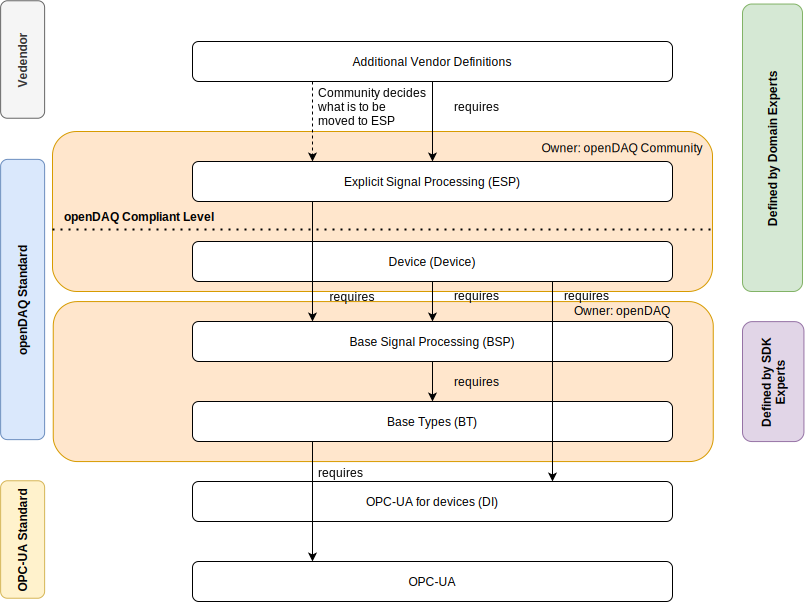

# Introduction

This respority stores/includes the `NodeSet2.xml`, `Types.bsd` and `NodeId.csv` file of the distributed openDAQ companion specifacation (cf. [openDAQ_OPC-UA_Specification](https://docs.opendaq.com/download/Specifications%20and%20documentation/opendaq_opc_ua_specification.pdf)). Besides this, constants are stored in 

The following figure shows how the openDAQ specification is structured and its dependencies.

## Error Codes

The Error Codes are as well standardized. For every NameSpace Layer own Error Codes are defined, so that different domains
are available. The error codes .csv files are stored in the folder `error-codes`.
The primary error code matches with defined error codes from opc-ua. For more specific infomration about an error a secondary code is used.
It is a GUI, which is available as a data type at opc-ua as well.